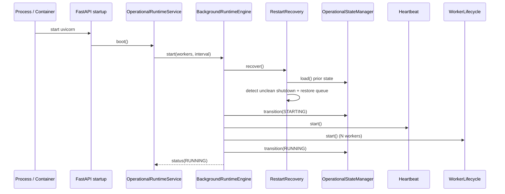
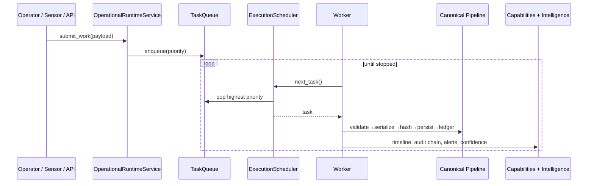
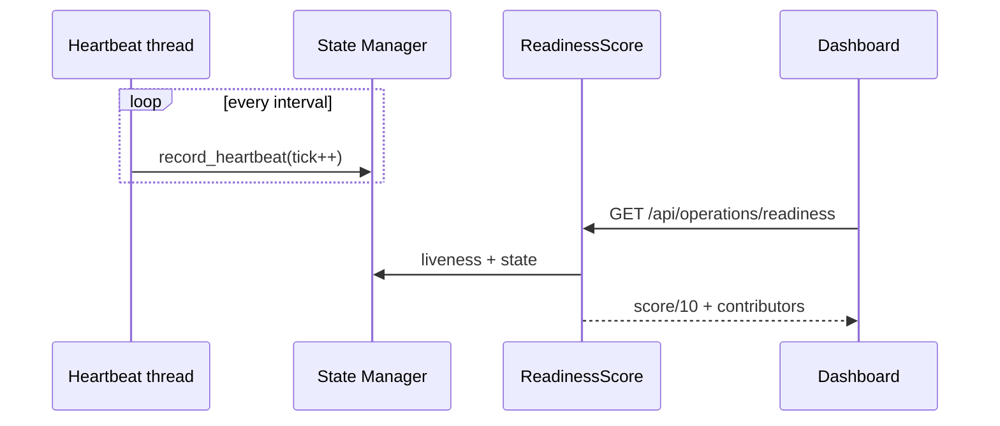
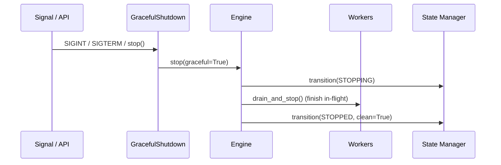

# Operational Sequence Diagrams

Mermaid sequence diagrams for the core operational flows. They render on
GitHub and in any Mermaid-aware viewer.

## 1. Runtime startup + restart recovery

## 2. Continuous work execution

## 3. Heartbeat + readiness

## 4. Graceful shutdown

