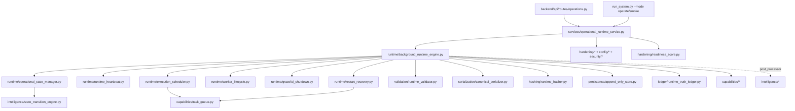

# Repository Dependency Graph

Canonical module relationships for `Live_Canonical_infrastructure_runtime-`.

## Pipeline Flow

```mermaid
flowchart TD
    CLI[run_system.py] --> RS[services/runtime_service.py]
    API[backend/api/routes/runs.py] --> RS

    RS --> DG[datasets/runtime_dataset_generator.py]
    RS --> DL[datasets/runtime_dataset_loader.py]
    RS --> RV[validation/runtime_validator.py]
    RS --> CS[serialization/canonical_serializer.py]
    RS --> RH[hashing/runtime_hasher.py]
    RS --> AOS[persistence/append_only_store.py]
    RS --> RR[replay/runtime_replayer.py]
    RS --> RTR[replay/runtime_truth_reconstructor.py]
    RS --> TV[validation/truth_verifier.py]
    RS --> RRec[recovery/runtime_recovery.py]
    RS --> IR[recovery/interrupted_recovery.py]
    RS --> RP[recovery/recovery_proof.py]
    RS --> FPE[validation/failure_path_executor.py]
    RS --> RO[observability/runtime_observer.py]
    RS --> RM[observability/runtime_metrics.py]
    RS --> FR[observability/final_runtime_reporter.py]

    RRec --> RPH[recovery/persistence_helpers.py]
    IR --> RPH
    IR --> RP
    RTR --> EL[services/event_loader.py]
    RTR --> RV
    RTR --> CS
    RTR --> RH
    RR --> CS
    RR --> RH
    RR --> AOS
    FPE --> EL
    FPE --> AOS
    EL --> AOS

    RO --> RM
    RO --> WS[backend/api/websocket.py]

    RCS[services/runtime_console_service.py] --> EL
    RCS --> RM
    RCS --> FR
    RCS --> RSvc[services/run_store.py]

    RT[backend/api/routes/runtime.py] --> RCS
    EV[backend/api/routes/events.py] --> EL
```

## Module Dependency Table

| Module | Depends On | Depended On By |
|--------|------------|----------------|
| `run_system.py` | `runtime_service` | CLI, E2E tests |
| `services/runtime_service.py` | datasets, validation, serialization, hashing, persistence, replay, recovery, observability | `runs.py`, CLI |
| `replay/runtime_replayer.py` | serializer, hasher, append_only_store | `runtime_service` |
| `replay/runtime_truth_reconstructor.py` | event_loader, validator, serializer, hasher | `runtime_service` |
| `validation/truth_verifier.py` | — | `runtime_service` |
| `validation/runtime_validator.py` | — | `runtime_service`, reconstructor |
| `validation/failure_path_executor.py` | event_loader, append_only_store | `runtime_service` |
| `recovery/runtime_recovery.py` | persistence_helpers | `runtime_service` (live) |
| `recovery/interrupted_recovery.py` | persistence_helpers, recovery_proof, event_loader | `runtime_service` (recover) |
| `recovery/persistence_helpers.py` | append_only_store | runtime_recovery, interrupted_recovery |
| `recovery/recovery_proof.py` | event_loader, append_only_store | live + recover paths |
| `persistence/append_only_store.py` | — | replay, recovery, event_loader, runtime_service |
| `serialization/canonical_serializer.py` | — | runtime_service, replayer, reconstructor |
| `hashing/runtime_hasher.py` | — | runtime_service, replayer, reconstructor |
| `services/event_loader.py` | append_only_store | reconstructor, recovery, APIs |
| `observability/runtime_observer.py` | runtime_metrics | runtime_service, websocket |
| `observability/runtime_metrics.py` | — | observer, console_service |
| `observability/final_runtime_reporter.py` | — | runtime_service, console_service |
| `services/runtime_console_service.py` | event_loader, metrics, run_store, final_reporter | `routes/runtime.py` |
| `services/run_store.py` | SQLite | `routes/runs.py`, console_service |
| `backend/api/main.py` | routes, websocket | HTTP entry |
| `frontend/` | `/api/runtime/*`, `/api/runs/*`, `/ws` | Dashboard UI |

## Log File Dependencies

| Log | Writer | Reader |
|-----|--------|--------|
| `logging/logs/live_execution.jsonl` | `runtime_service` (live) | replayer, reconstructor, recovery, event_loader |
| `logging/logs/replay_log.jsonl` | `runtime_replayer` | reconstructor, failure_path_executor |
| `logging/logs/recovery_log.jsonl` | persistence_helpers | reconstructor, failure_path_executor |
| `observability/final_runtime_report.json` | final_runtime_reporter | console_service, reports API |
| `observability/runtime_metrics.json` | runtime_metrics | console_service |
| `runtime_recovery_proof.json` | recovery_proof | validation guide, E2E tests |

## Canonical Counts (Post Phase 1)

| Concern | Count | Module |
|---------|-------|--------|
| Replay engine | 1 | `runtime_replayer.py` |
| Truth reconstructor | 1 | `runtime_truth_reconstructor.py` |
| Serializer | 1 | `canonical_serializer.py` |
| Hasher | 1 | `runtime_hasher.py` |
| Persistence | 1 | `append_only_store.py` |
| Event validator | 1 | `runtime_validator.py` |
| Truth verifier | 1 | `truth_verifier.py` |
| Recovery persistence | 1 | `persistence_helpers.py` |
| Observability core | 3 | observer, metrics, reporter |

**STATUS:** Single dependency graph — no parallel runtime stacks.

## Operational Runtime Backbone (Operational C5ISR Sprint)

The operational layer is additive and reuses the canonical primitives above —
no duplication of replay/recovery/ledger/observability.

### Operational module table

| Module | Depends On | Depended On By |
|--------|------------|----------------|
| `runtime/background_runtime_engine.py` | state manager, heartbeat, scheduler, workers, shutdown, restart recovery, canonical pipeline, capabilities | `operational_runtime_service`, CLI |
| `runtime/execution_scheduler.py` | `capabilities/task_queue` | engine, workers |
| `runtime/worker_lifecycle.py` | scheduler | engine |
| `runtime/operational_state_manager.py` | `intelligence/state_transition_engine` | engine, heartbeat, readiness, diagnostics |
| `runtime/restart_recovery.py` | state manager, task queue | engine |
| `capabilities/*` (13) | persistence, hashing, serialization | engine, service, intelligence |
| `intelligence/*` (10) | event_loader, live log | service, readiness, engine post-processor |
| `hardening/*` (10) | observability, intelligence, capabilities | service, readiness, diagnostics |
| `config/*`, `security/*` | env | engine boot, service |
| `services/operational_runtime_service.py` | runtime + capabilities + intelligence + hardening | `routes/operations.py`, CLI |
| `backend/api/routes/operations.py` | operational service | HTTP / dashboard |

### Operational log files

| Log | Writer | Reader |
|-----|--------|--------|
| `data/operational_state.json` | state manager | engine, restart recovery, readiness |
| `data/runtime_queue.json` | task queue | scheduler, restart recovery |
| `logging/logs/situation_timeline.jsonl` | situation timeline | dashboard, situation API |
| `logging/logs/alerts.jsonl` | alert pipeline | alerts API |
| `logging/logs/execution_audit_chain.jsonl` | audit chain | audit verify, diagnostics |
| `logging/logs/operator_actions.jsonl` | operator actions | operator timeline API |
| `logging/logs/operational_runtime.jsonl` | structured logger | diagnostics |

**OPERATIONAL STATUS:** one engine, one queue, one state file — the backbone is
additive over the canonical platform with no parallel stacks.
